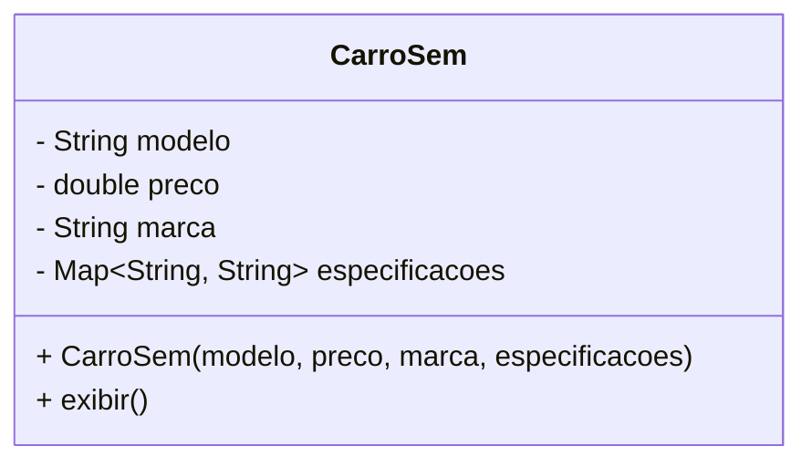
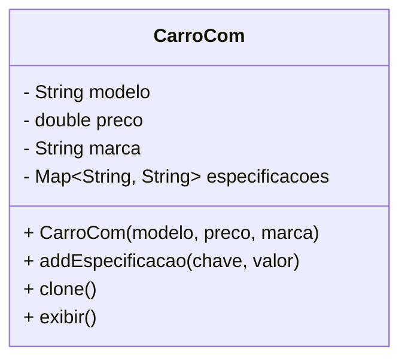

# Prototype

### Padrão de Projeto Criacional

## Intenção

O padrão Prototype permite a criação de novos objetos clonando uma instância existente, evitando a criação direta e tornando o processo mais eficiente. Isso é útil quando a inicialização de um objeto é custosa e uma cópia pode ser mais vantajosa.

## Motivação
Sistemas de gestão para concessionárias, lida com múltiplas variações de um mesmo objeto. Veículos podem mudar de  modelo, preço, marca e algumas especificações.

Criar manualmente cada variação de um objeto pode resultar em redundância de código, aumentar a probabilidade de erros e tornar o sistema mais complexo. O padrão de projeto Prototype resolve esse problema ao permitir a clonagem de objetos protótipo. Dessa forma, em vez de recriar um novo objeto do zero, você pode clonar um protótipo e apenas alterar os atributos necessários. Isso ajuda a reduzir a duplicação de código

## Aplicabilidade

Use o padrão **Prototype** quando for necessário que o sistema funcione sem depender da forma como seus objetos são criados, estruturados e representados.

Ele é útil quando:

- As classes a serem instanciadas são definidas em tempo de execução, como no caso de carregamento dinâmico;
- Você deseja evitar uma hierarquia extensa de fábricas para criar objetos, paralela à hierarquia de produtos;
- Os objetos possuem algumas variações específicas de estado, tornando mais prático criar protótipos e cloná-los, em vez de instanciar manualmente cada um com as configurações corretas.

## Estrutura GOF


## Participantes
- **Prototype (`Graphic`)**  
  Define uma interface para a clonagem de objetos.  

- **ConcretePrototype (`Staff`, `Whole Nota`, `Half Note`)**  
  Implementa a clonagem, permitindo que cada tipo de objeto crie uma cópia de si mesmo.  

- **Client (`GraphicTool`)**  
  Cria novos objetos solicitando a clonagem de um protótipo, facilitando a geração de instâncias sem precisar lidar com detalhes de implementação.  

## Estrutura

### Antes do Prototype (Criação Manual)


### Depois com Prototype (Usando Clone)


## Participantes
Prototype (): A interface Cloneable e o método clone() que permitem a clonagem de objetos. No caso, a classe CarroCom é o Prototype.

ConcretePrototype: A classe concreta que implementa a clonagem. No código, CarroCom é o ConcretePrototype, pois define o método clone() para criar cópias do objeto.

Client: O código que utiliza o protótipo para criar novos objetos. Aqui, o cliente seria o código no TesteCarroCom() que cria e clona uma instância de CarroCom.

## Herança
 É uma relação "é um" entre classes, onde a subclasse herda atributos e comportamentos da superclasse. A subclasse pode adicionar ou modificar comportamentos, mas a estrutura é fixa após a definição.

- **Relação hierárquica**: A subclasse **é um tipo** da superclasse (ex: Cachorro é um Animal).
- **Comportamento fixo**: Métodos e atributos da subclasse são definidos na superclasse e não mudam em tempo de execução.
- **Exemplo**: A classe **Cachorro** herda os atributos e métodos da classe **Animal**.

## Prototype (Clone)
 Cria novos objetos clonando um protótipo existente e, em seguida, personalizando o clone.

- **Relação de cópia**: Criação de novos objetos a partir de um protótipo existente.
- **Flexibilidade**: O novo objeto pode ser alterado após a clonagem, sem afetar o protótipo original.
- **Exemplo**: Clonar um Carro e alterar atributos como cor ou modelo.

## Exemplo de Código

### CarroCom.java
```java
package CarroComPrototype;
import java.util.HashMap;
import java.util.Map;

class CarroCom implements Cloneable {
    private String modelo;
    private double preco;
    private String marca;
    private Map<String, String> especificacoes;

    public CarroCom(String modelo, double preco, String marca) {
        this.modelo = modelo;
        this.preco = preco;
        this.marca = marca;
        this.especificacoes = new HashMap<>();
    }

    public void addEspecificacao(String chave, String valor) {
        especificacoes.put(chave, valor);
    }

    @Override
    public CarroCom clone() {
        try {
            CarroCom clone = (CarroCom) super.clone();
            clone.especificacoes = new HashMap<>(this.especificacoes);
            return clone;
        } catch (CloneNotSupportedException e) {
            throw new RuntimeException("Erro ao clonar o carro", e);
        }
    }

    public void exibir() {
        System.out.println("Carro: " + modelo + ", Preco: " + preco + ", Marca: " + marca + ", Especificacoes: " + especificacoes);
    }
}
```

### TesteCarroCom.java
```java
package CarroComPrototype;

public class TesteCarroCom {
    public static void main(String[] args) {
        CarroCom carroBase = new CarroCom("Sedan", 80000.00, "Toyota");
        carroBase.addEspecificacao("Cor", "Prata");

        CarroCom carroEsportivo = carroBase.clone();
        carroEsportivo.addEspecificacao("Motor", "V6 Turbo");

        CarroCom carroLuxo = carroBase.clone();
        carroLuxo.addEspecificacao("Interior", "Couro Premium");

        carroBase.exibir();
        carroEsportivo.exibir();
        carroLuxo.exibir();
    }
}
```

## Consequências

O **Prototype** compartilha vantagens com padrões como Abstract Factory e Builder, ocultando classes concretas e reduzindo a necessidade de o cliente conhecer muitos nomes. Além disso, permite trabalhar com classes específicas sem modificações diretas.  

### Principais Benefícios:  

- **Criação dinâmica de objetos**: Novos produtos podem ser adicionados ou removidos em tempo de execução apenas registrando um protótipo, sem alterar o código.  
- **Personalização por valores**: Em sistemas dinâmicos, novos objetos podem ser definidos por configuração, sem necessidade de criar novas classes.  
- **Estruturas reutilizáveis**: Objetos compostos podem ser clonados para facilitar a reutilização, como em editores gráficos ou de circuitos.  
- **Menos subclasses**: Evita a necessidade de uma hierarquia paralela de fábricas, reduzindo a complexidade do sistema.  
- **Carregamento dinâmico**: Permite configurar aplicações para criar instâncias de classes carregadas em tempo de execução, sem referenciá-las estaticamente.  

### Desafio:  
Cada subclasse precisa implementar a operação `Clone`, o que pode ser complicado em estruturas internas complexas ou com referências circulares.  

## Deep Clone
O conceito de Cópia Profunda (ou Deep Clone) refere-se ao processo de clonagem de um objeto de forma que os objetos internos (como objetos referenciados) também sejam copiados, e não apenas as referências a esses objetos. Isso garante que, após a clonagem, as alterações realizadas na cópia não afetem o objeto original, e vice-versa.

```java
class Endereco implements Cloneable {
    String rua;
    String cidade;

    public Endereco(String rua, String cidade) {
        this.rua = rua;
        this.cidade = cidade;
    }

    @Override
    public Endereco clone() {
        try {
            return (Endereco) super.clone();
        } catch (CloneNotSupportedException e) {
            throw new AssertionError();
        }
    }

    @Override
    public String toString() {
        return "Endereco{rua='" + rua + "', cidade='" + cidade + "'}";
    }
}

```
- A classe Endereco implementa a interface Cloneable e sobrescreve o método clone() para permitir a clonagem do objeto. Aqui, a clonagem cria uma cópia do objeto Endereco, não apenas uma referência.


```java
class Pessoa implements Cloneable {
    String nome;
    int idade;
    Endereco endereco;

    public Pessoa(String nome, int idade, Endereco endereco) {
        this.nome = nome;
        this.idade = idade;
        this.endereco = endereco;
    }

    @Override
    public Pessoa clone() {
        try {
            Pessoa copia = (Pessoa) super.clone();
            copia.endereco = this.endereco.clone();
            return copia;
        } catch (CloneNotSupportedException e) {
            throw new AssertionError();
        }
    }

    @Override
    public String toString() {
        return "Pessoa{nome='" + nome + "', idade=" + idade + ", endereco=" + endereco + "}";
    }
}

```
- Na classe Pessoa, o método clone() garante que, além de clonar o próprio objeto Pessoa, o objeto Endereco contido seja também clonado de forma profunda. Isso assegura que a cópia tenha uma instância independente de Endereco.


```java
public class Main {
    public static void main(String[] args) {
        Endereco enderecoOriginal = new Endereco("Rua Enersto Melo", "SAJ");
        Pessoa pessoaOriginal = new Pessoa("João", 30, enderecoOriginal);

        Pessoa pessoaCopia = pessoaOriginal.clone();

        pessoaCopia.nome = "Maria";
        pessoaCopia.endereco.rua = "Rua Ipe Rosa";
        pessoaCopia.idade = 25;

        System.out.println("Pessoa Original: " + pessoaOriginal);
        System.out.println("Pessoa Cópia: " + pessoaCopia);
    }
}

```
### Explicação:
Pessoa Original: O objeto original tem os valores de nome "João", idade 30, e o endereço "Rua Enersto Melo".
Pessoa Cópia: A cópia tem o nome alterado para "Maria", a idade para 25 e o endereço para "Rua Ipe Rosa". O essencial é que a cópia profunda garante que a alteração do endereço na cópia não afete o endereço do objeto original.

## Como Linguagens Não-Orientadas a Objetos Simulam Herança Usando o Padrão Prototype
Em linguagens que não possuem suporte nativo a Orientação a Objetos (OO), como C ou JavaScript (antes do ES6), o Padrão Prototype é frequentemente utilizado para simular herança. Esse padrão permite que objetos sejam clonados a partir de um protótipo base, estendendo suas propriedades e comportamentos sem a necessidade de classes formais.

#### Implementação:
```javascript
function Personagem(nome, nivel) {
    this.nome = nome;
    this.nivel = nivel;
}

Personagem.prototype.atacar = function () {
    return `${this.nome} ataca com um golpe básico!`;
};

function Guerreiro(nome, nivel, arma) {
    Personagem.call(this, nome, nivel);
    this.arma = arma;
}

Guerreiro.prototype = Object.create(Personagem.prototype);
Guerreiro.prototype.constructor = Guerreiro;

Guerreiro.prototype.atacar = function () {
    return `${this.nome} ataca com ${this.arma}!`;
};

function Mago(nome, nivel, elemento) {
    Personagem.call(this, nome, nivel);
    this.elemento = elemento;
}

Mago.prototype = Object.create(Personagem.prototype);
Mago.prototype.constructor = Mago;

Mago.prototype.atacar = function () {
    return `${this.nome} lança um feitiço de ${this.elemento}!`;
};

function testarHeranca() {
    const personagemBase = new Personagem("Aventureiro", 1);
    const guerreiro = new Guerreiro("Thor", 5, "Martelo");
    const mago = new Mago("Merlin", 10, "fogo");

    const resultado = `
        <p>${personagemBase.atacar()}</p>
        <p>${guerreiro.atacar()}</p>
        <p>${mago.atacar()}</p>
    `;

    document.getElementById("resultado").innerHTML = resultado;
}
```
### Explicação:
- **Personagem:** A função Personagem define as propriedades nome e nivel, além do método atacar(), que é compartilhado por todas as instâncias.
- **Guerreiro:** Para criar um tipo de personagem mais específico, como um Guerreiro, utilizamos o método Personagem.call(this, nome, nivel) para herdar as propriedades do Personagem. Além disso, adicionamos a propriedade arma para que o guerreiro tenha uma arma. O método atacar() é sobrescrito para que o ataque do guerreiro seja relacionado ao uso de sua arma.
- **Mago:** Herda de Personagem, adiciona elemento e sobrescreve atacar() para lançar um feitiço de acordo com o tipo de elemento.

## Usos Conhecidos
 - O Google Docs é um exemplo prático do uso do padrão de design Prototype na criação e manipulação de documentos. Ao permitir que os usuários criem novos documentos a partir de modelos existentes, o Google Docs utiliza a clonagem de protótipos para garantir consistência e eficiência.
 
  - O Canva é um excelente exemplo do uso do padrão de design Prototype na criação e edição de designs gráficos. A plataforma permite que os usuários desenvolvam novos projetos a partir de modelos pré-existentes, utilizando a clonagem de protótipos para garantir uma experiência de design consistente e eficiente. 

## Padrões Relacionados  

Os padrões **Prototype** e **Abstract Factory** podem parecer semelhantes em algumas situações, mas na verdade, eles podem ser usados em conjunto para aumentar a flexibilidade de um sistema. O **Prototype** permite criar novos objetos por clonagem, enquanto o **Abstract Factory** armazena protótipos e os utiliza para gerar instâncias de produtos de forma dinâmica, conforme a necessidade.

Além disso, quando combinados com padrões como **Composite** e **Decorator**, o **Prototype** se torna ainda mais valioso. Ele oferece uma maneira eficiente de criar e modificar objetos em sistemas mais complexos, permitindo que você faça alterações sem a necessidade de reconstruir toda a estrutura, o que traz mais agilidade e escalabilidade ao desenvolvimento.  

## Referências
- GAMMA, Erich; HELM, Richard; JOHNSON, Ralph; VLISSIDES, John. *Padrões de Projetos: Soluções Reutilizáveis de Software Orientados a Objetos*. Bookman, 2000.
- [Macoratti.net](https://macoratti.net/21/08/c_prototype1.htm)

